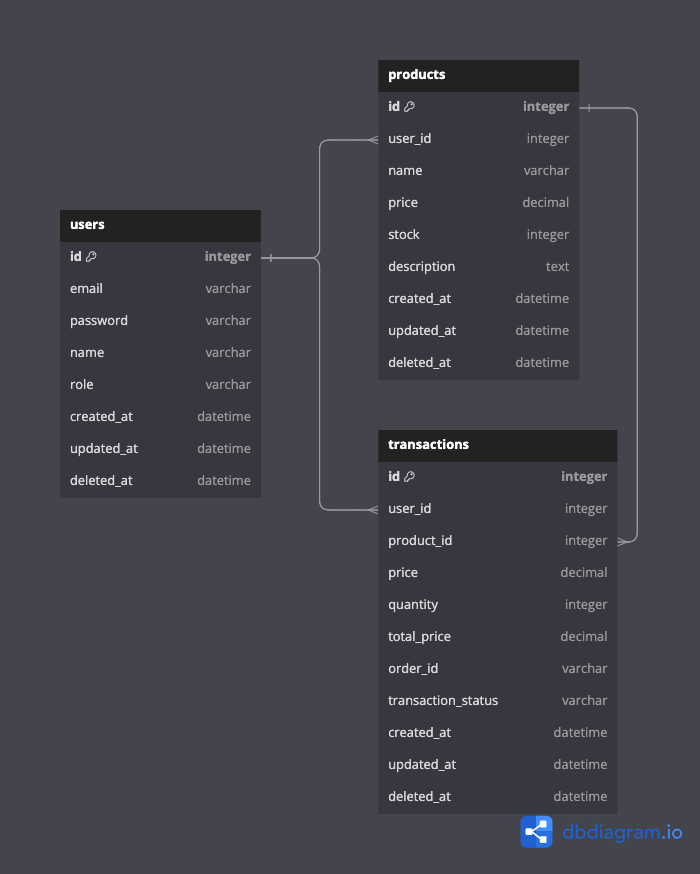

# Go-Commerce
 
## About
Repository ini digunakan untuk referensi belajar membuat Rest API menggunakan Golang dengan MVC architecture.
Project ini adalah project ecommerce sederhana dengan fitur manajemen data user, product dan transaksi.
Project ini juga sudah dilengkapi dengan mekanisme hashing password dan JWT auth untuk security.


## ERD


## Tech stack
* Golang
* Echo Web Framework https://echo.labstack.com/
* Gorm ORM https://gorm.io/
* JWT Auth https://jwt.io/
* PosgreSQL
* Docker https://docker.com
* Swagger (Swaggo) https://github.com/swaggo/swag

## How to run
### Using Docker Compose
NB: ketika menggunakan docker compose, docker akan menjalankan aplikasi go-commerce dan database postgres secara bersamaan.

1. Pastikan docker sudah terinstall
    * https://docs.docker.com/desktop/
    * https://docs.docker.com/compose/

2. Jalankan Docker compose
    ```bash
    docker-compose up -d
    ```

3. Stop/terminate aplikasi
    ```bash
    docker-compose down
    ```

### Manual
NB: Aplikasi go-commerce membutuhkan database PostgreSQL, jadi sebelum menjalankan app, pastikan sudah terinstall di perangkat masing-masing. atau bisa juga menggunakan layanan postgresql online.

1. Pastikan sudah ada database dengan nama `db_commerce` di PostgreSQL. (nama bisa disesuaikan dengan kebutuhan)
2. Buat file `.env`
   Sesuaikan valuenya dengan konfigurasi yang ada di perangkat masing-masing.
    ```env
    DBHOST=your-db-host
    DBUSER=your-db-user
    DBPASS=your-db-password
    DBNAME=your-db-name
    DBPORT=your-db-port
    JWTSECRET=your-jwt-secret
    ```
3. Jalankan app
    ```bash
    go run main.go
    ```

## API Documentation 
ketika aplikasi sudah berjalan, API documentation (swagger) bisa diakses di alamat berikut:
    ```
    http://localhost:8080/swagger/index.html/
    ```